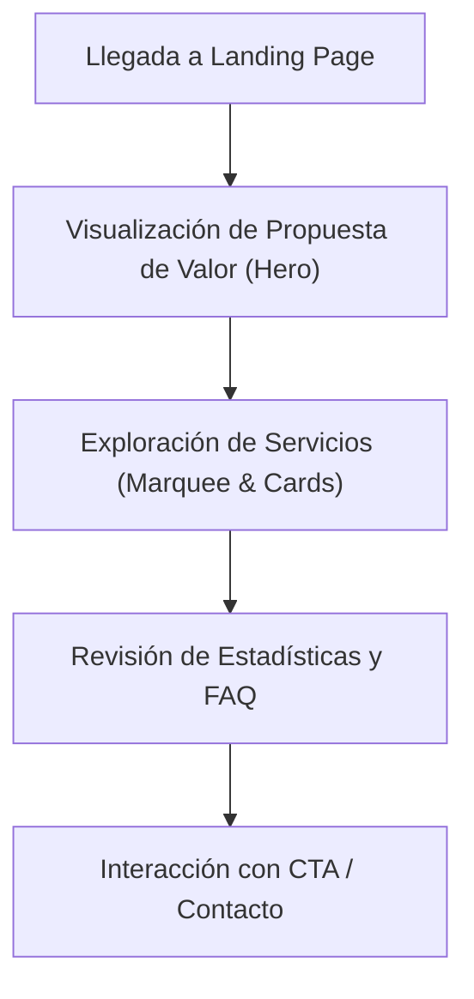

## 1. Resumen del Producto
El proyecto consiste en el sitio web corporativo de Micrudev, una agencia de desarrollo enfocada en ofrecer soluciones tecnológicas que simplifican procesos.
El sitio comunicará profesionalismo, confiabilidad y un nivel premium, empleando un estilo visual único denominado "Micrudev Swiss Ambient", que fusiona el minimalismo suizo con el Glassmorphism y una interfaz de iluminación ambiental (Ambient Light UI).

## 2. Características Principales

### 2.1 Módulos de Funcionalidad
1. **Página de Inicio (Home)**: Navbar glass, Hero section con Ambient Light, servicios (Marquee), Stats, y panel de CTA.
2. **Componentes Universales**: Footer, orbes de luz ambiental de fondo, y sistema de grilla de puntos.

### 2.2 Detalles de Página
| Nombre de Página | Nombre del Módulo | Descripción de Funcionalidad |
|------------------|-------------------|------------------------------|
| Inicio | Navbar | Navegación superior tipo "sticky glass" con el logo de Micrudev y menú. |
| Inicio | Hero Section | Titular contundente, orbes de luz de fondo, efecto parallax sutil y botones de acción tipo pill. |
| Inicio | Servicios | Marquee horizontal infinito mostrando los servicios ofrecidos. |
| Inicio | Estadísticas | Números grandes con halo de glow azul que transmiten confianza y experiencia. |
| Inicio | FAQ | Lista de preguntas frecuentes en formato acordeón. |
| Inicio | CTA Panel | Sección oscura de alto contraste para incentivar el contacto. |
| Global | Footer | Información de la marca, enlaces rápidos, contacto y barra inferior. |

## 3. Flujo Principal
Los usuarios ingresan al sitio web y son recibidos por una interfaz inmersiva. Navegan por la propuesta de valor y los servicios de la agencia, visualizan estadísticas clave y preguntas frecuentes, culminando en un CTA que los invita a contactar a Micrudev.

## 4. Diseño de Interfaz de Usuario

### 4.1 Estilo de Diseño
- **Concepto**: Minimalismo suizo y editorial + Ambient Light UI + Glassmorphism. Mucho aire, jerarquía tipográfica fuerte, grillas estrictas y textura de puntos.
- **Paleta de Colores**:
  - `--navy`: `#06132F`
  - `--blue`: `#0253FD` (acento principal)
  - `--blue-700`: `#003DCC` (hover)
  - `--blue-400`: `#4C84FF` (enlaces)
  - `--blue-100`: `#E7EFFF` (fondos suaves)
  - `--surface`: `#F6F8FC`
  - `--ink`: `#0F1B37`
  - `--muted`: `#637089`
  - `--white`: `#FFFFFF`
- **Temas**:
  - *Light (por defecto)*: Fondo `--surface`, texto `--ink`, secundario `--muted`, orbes azules tenues (opacidad 0.12-0.28) + puntos navy (0.04).
  - *Dark (Hero/CTA/Footer)*: Fondo `--navy`, texto blanco, orbes vívidos (screen/lighten) + puntos blancos (0.06).
- **Tipografía**: Inter (fallback Arial, sans-serif). Titulares grandes (clamp ~2rem→3.5rem, bold), cuerpo en `--muted`.
- **Radius**: Reemplazo de bordes rectos. `sm` (10px), `md` (16px), `lg` (24px), `pill` (999px).
- **Sombra/Glow**: `0 12px 32px rgba(6,19,47,.10)` (light) y glow azul en dark.
- **Efectos y Fondos**: 
  - Capas: Orbes de luz (radial-gradient, blur 110px) debajo, dot grid encima, componentes glassmorphism arriba con `backdrop-blur`.

### 4.2 Resumen de Diseño de Páginas
| Nombre de Página | Nombre del Módulo | Elementos de UI |
|------------------|-------------------|-----------------|
| Inicio | Fondos Globales | Capa 1: orbes flotantes animados. Capa 2: Dot grid `24px`. |
| Inicio | Navbar | Glassmorphism, bg semitransparente, sombra, radius-lg/pill. Logo ≥ 140px. |
| Inicio | Botones | Primario Pill sólido `--blue`. Secundario pill con borde. |
| Inicio | Cards | Layout bento, glassmorphism redondeado (radius-md/lg), border translúcido. |
| Inicio | CTA | Panel dark full-bleed con orbe azul intenso y botón claro. |

### 4.3 Responsividad
- **Desktop**: Efectos completos, animaciones float, parallax con el mouse en los orbes, grilla completa. Contenedor max 1200-1280px, padding 24-32px.
- **Tablet**: Efectos simplificados, grilla adaptada a 2 columnas.
- **Mobile (<768px)**: 2 orbes simplificados (blur 60px), sin parallax, animaciones básicas, dot grid mantenido, navbar tipo hamburguesa, padding de 24px.
