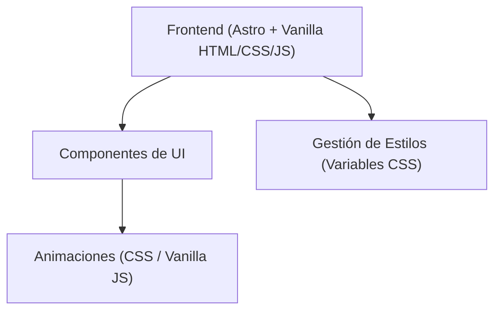

## 1. Diseño de Arquitectura

## 2. Descripción de Tecnología
- **Frontend**: Astro v7 + HTML + Vanilla CSS + Vanilla JS.
- **Motivación**: Se prioriza un enfoque minimalista sin dependencias pesadas, en alineación con las preferencias de desarrollo para mantener un código limpio, rápido y aplicando el principio DRY.
- **Herramientas Adicionales**: CSS Variables para el sistema de diseño, CSS Grid/Flexbox para los layouts Bento y Suizos.
- **Gestión de Assets**: Archivos locales para logos e íconos SVG/PNG, priorizando las versiones proporcionadas de Micrudev.

## 3. Definiciones de Rutas
| Ruta | Propósito |
|------|-----------|
| `/` | Página de Inicio principal (Landing page) |

## 4. Estructura de Componentes
El proyecto utilizará componentes `.astro` estructurados de la siguiente manera:
- `Layout.astro`: Layout base que inyecta las variables CSS globales, las fuentes (Inter), y los elementos de fondo (orbes y dot grid).
- `Navbar.astro`: Navegación principal tipo glassmorphism.
- `Hero.astro`: Sección de introducción.
- `ServicesMarquee.astro`: Carrusel infinito CSS para los servicios.
- `BentoCards.astro`: Cuadrícula estilo bento para características/servicios.
- `Stats.astro`: Componente de números destacados.
- `CTA.astro`: Panel oscuro de llamada a la acción.
- `Footer.astro`: Pie de página.

## 5. Implementación de Efectos Visuales
- **Orbes Ambientales**: `div`s absolutos con `filter: blur()`, `mix-blend-mode` y gradientes radiales. Animados mediante CSS `@keyframes` y `will-change`.
- **Dot Grid**: `background-image: radial-gradient(...)` aplicado sobre un pseudo-elemento o contenedor global con opacidad baja.
- **Glassmorphism**: Combinación de `background: rgba(...)` y `backdrop-filter: blur(12px)`.
- **Parallax**: Implementado con un script ligero en Vanilla JS que escucha el evento `mousemove` en pantallas desktop para desplazar levemente los orbes en direcciones opuestas.
